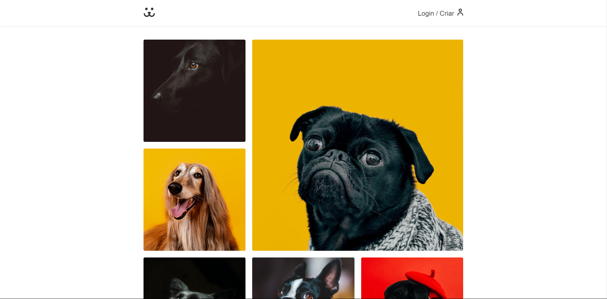
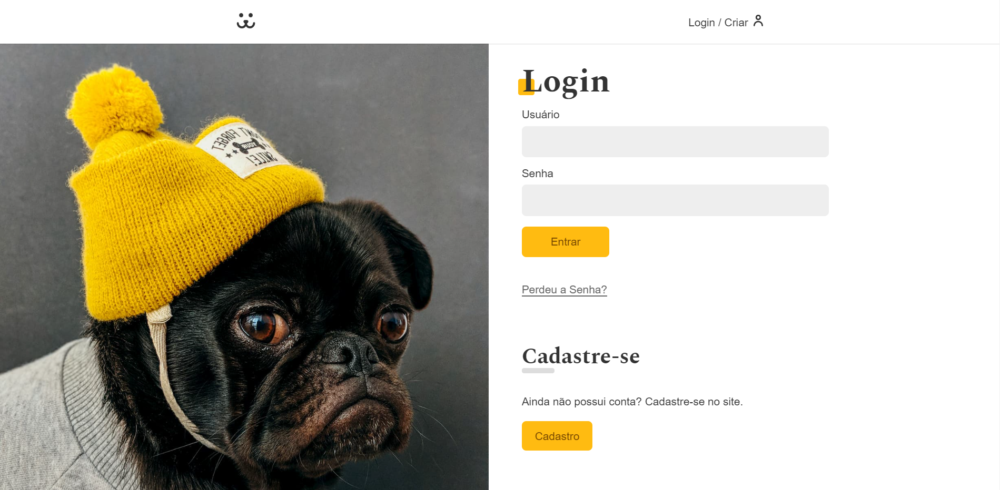
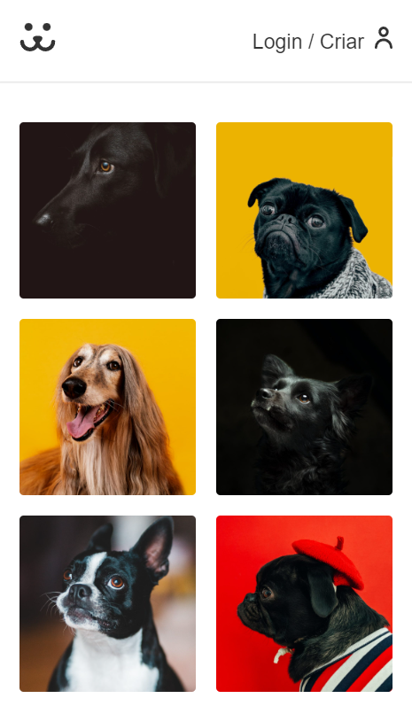
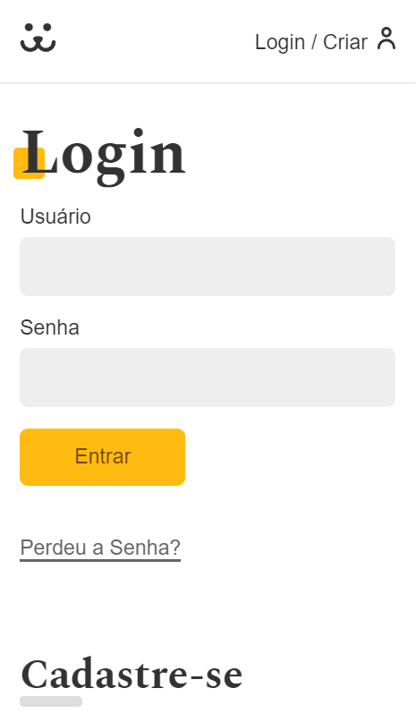

<h1 align="center"> Rede Social - Dogs </h1>

  <a href="#-tecnologias">Tecnologias</a>&nbsp;&nbsp;&nbsp;|&nbsp;&nbsp;&nbsp;
  <a href="#-projeto">Projeto</a>&nbsp;&nbsp;&nbsp;|&nbsp;&nbsp;&nbsp;
  <a href="#memo-licença">Licença</a>

  

 

<h1>Desktop:</h1>
  
  
  
 
<h1>Mobile:</h1>
  
  

## 🚀 Tecnologias

Esse projeto foi desenvolvido com as seguintes tecnologias:

- React
- React Router
- Victory
- CSS Modules

## 💻 Projeto
Este é o projeto final desenvolvido no curso React Completo oferecido pela plataforma de ensino Origamid. O objetivo deste projeto foi construir uma rede social para cachorros, similar ao Instagram. Na rede social, é possível criar um usuário, fazer login, postar fotos, ver suas próprias fotos ou de outros usuários, ver gráficos com estatísticas das fotos postadas e, caso o usuário esqueça a senha, é possível redefini-la.

## 📝 Licença

Esse projeto está sob a licença MIT.

---
